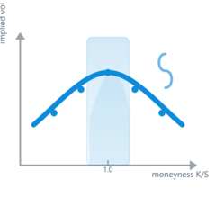

```{r, include=FALSE}
knitr::opts_chunk$set(collapse = TRUE, comment = ">")
```

# rqmoms 

**Option-Implied Moments & Diagnostics in Pure R** — a faithful port of the Python package **[vilkovgr/qmoms](https://github.com/vilkovgr/qmoms)** with identical function signatures, output keys, and defaults.

<!-- badges: start -->

[](https://github.com/sstoeckl/rqmoms/actions/workflows/pkgdown.yaml)

<!-- badges: end -->

> ⚖️ *Scientific intent:* `rqmoms` aims for **numerical identity** with the reference Python implementation for a given IV surface and parameter set. A dev-only Python reference workflow (ignored in builds) can be used locally to double-check results.

## Installation

Soon, installation should be possible from CRAN
```{r cran-installation, eval = FALSE}
# From source (development)
install.packages("rqmoms")
```

util then it can be installed from github with:
```{r gh-installation, eval = FALSE}
# install.packages("devtools")
devtools::install_github("sstoeckl/rqmoms")
```

`rqmoms` imports: `dplyr`, `tibble`, `purrr`, `cli`, `stats`, `vctrs`, `pracma`.

---

## Packaged example data

This package ships two datasets (loaded automatically with `library(rqmoms)`):

* `qmoms_surface` — IV surface snapshots (columns: `id`, `date`, `days`, `mnes`, `impl_volatility`, optional: `delta`, `best_bid`, `best_offer`, `open_interest`, `prem`)
* `qmoms_zerocd`  — zero curve by `date` and `days` (in **decimal**; e.g. `0.02` = 2% p.a.)

They are derived from the Python repo’s `data/surface.csv` and `data/zerocd.csv`.

```{r}
library(rqmoms)
str(qmoms_surface)
head(qmoms_zerocd)
```

---

## Quick start — single surface (mirrors Python `qmoms_compute()`)

```{r}
params <- rq_default_params()

# pick one (id, date, days)
one <- subset(qmoms_surface,
              id == qmoms_surface$id[1] & days == qmoms_surface$days[1])

# rate from the zero curve (interpolated at this date/maturity)
r30  <- get_rate_for_maturity(qmoms_zerocd,
                              date = one$date[1],
                              days = one$days[1])

res <- qmoms_compute(
  mnes   = one$mnes,
  vol    = one$impl_volatility,
  days   = one$days[1],
  rate   = r30,
  params = params,
  output = "list"
)
str(res)
```

---

## Whole-dataframe — grouped compute (mirrors Python README)

First, merge/interpolate rates into the surface:

```{r}
library(dplyr)

# exact-maturity rate interpolation by date
surf_r <- get_rate_for_maturity(qmoms_zerocd, df_surf = qmoms_surface)
```

### A) dplyr `group_map()`


```{r}
res_bygroup <- surf_r |>
  dplyr::group_by(id, date, days) |>
  dplyr::group_map(~{
    # .x: rows of the group (no keys); .y: one-row tibble of keys
    tibble::as_tibble(
      c(
        list(id = .y$id[[1]], date = .y$date[[1]], days = .y$days[[1]]),
        qmoms_compute(
          mnes   = .x$mnes,
          vol    = .x$impl_volatility,
          days   = .y$days[[1]],
          rate   = .x$rate[1],
          params = params,
          output = "list"
        )
      )
    )
  }) |>
  dplyr::bind_rows()

dplyr::glimpse(res_bygroup)
```

### B) Convenience wrapper `qmoms_compute_bygroup()`

If you prefer, you can call the wrapper on each group.

```{r}
res_bygroup2 <- surf_r |>
  dplyr::group_by(id, date, days) |>
  dplyr::group_map(~{
    qmoms_compute_bygroup(
      list(.x, params),
      id   = .y$id[[1]],
      date = .y$date[[1]],
      days = .y$days[[1]],
      rate = .x$rate[1]
    )
  }) |>
  dplyr::bind_rows()

# Same result (up to column order)
dplyr::all_equal(
  dplyr::arrange(res_bygroup,  id, date, days),
  dplyr::arrange(res_bygroup2, id, date, days)
)
```

### C) Column mapping example (mirrors Python column/dtype mapping)

```{r}
# rename columns
df_alt <- surf_r |>
  dplyr::rename(ID = id, Date = date, Days = days, Rate = rate, M = mnes, IV = impl_volatility)

# mapping for the wrapper
map <- list(id = "ID", date = "Date", days = "Days", rate = "Rate", mnes = "M", impl_volatility = "IV")

# one group through the wrapper
gs <- df_alt |>
  dplyr::group_by(ID, Date, Days) |>
  dplyr::group_split()

ex_mapped <- qmoms_compute_bygroup(
  list(gs[[1]], params),
  id   = dplyr::first(gs[[1]]$ID),
  date = dplyr::first(gs[[1]]$Date),
  days = dplyr::first(gs[[1]]$Days),
  rate = dplyr::first(gs[[1]]$Rate),
  cols_map = map
)
ex_mapped
```

---

## Parameters — defaults & customization

Defaults mirror Python (grid, filters, CVIX/TLM windows, slope windows):

```{r}
rq_default_params()
```

### Change what’s computed and tweak windows

```{r}
params2 <- rq_default_params()

# Example: turn off TLM, adjust slope & CVIX windows
params2 <- utils::modifyList(params2, list(
  tlm   = list(compute = FALSE),
  slope = list(compute = TRUE, deltaP_lim = c(-0.4, -0.1), deltaC_lim = c(0.05, 0.5)),
  cvix  = list(compute = TRUE, abs_dev = list(0.1, 0.2, 0.3), vol_dev = list(1.5, 2))
))

one <- subset(qmoms_surface, id == qmoms_surface$id[1] & days == qmoms_surface$days[1])
r30 <- get_rate_for_maturity(qmoms_zerocd, date = one$date[1], days = one$days[1])
res_custom <- qmoms_compute(one$mnes, one$impl_volatility, one$days[1], r30, params2, output = "list")

str(res_custom[names(res_custom)[startsWith(names(res_custom), "cvix_")]])
```

### Slopes (sign convention)

`slopedn` is the **OLS slope** of IV on Δ on the put side; `slopeup` is **minus** the OLS slope on the call side (larger `slopeup` ⇒ steeper right tail). This matches the Python implementation.

---

## Dev: Python parity vignette

A vignette **“Python parity: R vs Python outputs”** reproduces the grouped examples and prints side-by-side diffs for all metrics.

* **Coming soon:** `vignettes/python-parity.Rmd`
* It will appear on the pkgdown site under **Articles → Python parity**.

*(The vignette is optional and only for developers who keep a local clone of the Python repo in `python/qmoms_src` with a private virtualenv. The R package itself is pure R.)*

---

## What does `qmoms_compute()` return?

Keys match the Python package exactly:

| Key                 | Meaning (brief)                                                                     |
| ------------------- | ----------------------------------------------------------------------------------- |
| `nopt`              | Number of options used                                                              |
| `smfiv`             | Martin’s model-free implied variance                                                |
| `mfiv_bkm`          | BKM (Bakshi–Kapadia–Madan) variance kernel                                          |
| `mfiv_bjn`          | Alternative variance kernel                                                         |
| `smfivd`            | Semi-variance (downside)                                                            |
| `mfivd_bkm`         | Semi-variance (BKM kernel)                                                          |
| `mfivd_bjn`         | Semi-variance (BJN kernel)                                                          |
| `mfis`              | Implied skewness (BKM)                                                              |
| `mfik`              | Implied kurtosis (BKM)                                                              |
| `cvix_*`            | Curvature window integrals (by vol window `sigmaX` or abs moneyness window `mnesY`) |
| `rix`, `rixnorm`    | Difference & normalized difference between BKM and BJN downside integrals           |
| `tlm_*`             | Tail loss measure for delta/vol windows                                             |
| `slopedn`/`slopeup` | OLS slope of IV on Δ in put/call windows (call side reported with a negative sign)  |

---

## Citation & Credits

This package is a **pure-R re-implementation** of **[vilkovgr/qmoms](https://github.com/vilkovgr/qmoms)**. If you use `rqmoms`, please also cite the original Python package and related research by the authors.

## License

MIT. See `LICENSE`.

```

---

### Notes

- The README now **only** uses packaged datasets, so it knits cleanly and works on the pkgdown site.
- The `group_map()` sections are corrected to use **`.y`** for keys — fixing your error.
- I left both grouped approaches (manual `group_map` and the wrapper) so users can pick their style.
- The README references the **Python parity** vignette (to be added next). If you want, I can drop in a vignette skeleton that runs R↔Python checks over all groups and prints a tidy diff table.
::contentReference[oaicite:0]{index=0}
```
